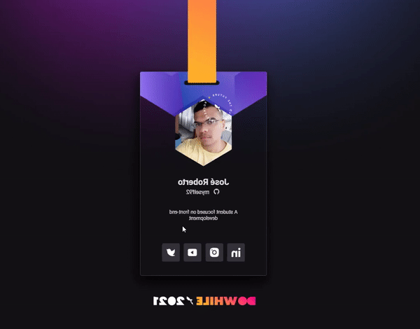

<h1 align="center">
  
</h1>

<h2 align="center">🚀 Badge Do While 2021 - Subscribe to <a href="https://dowhile.io/inscricao">DoWhile 2021</a></h2>

  <a href="#why">Why</a> •
  <a href="#layout">Layout</a> •
  <a href="#tech-stack">Tech Stack</a> 

  

  

 

<h2 id="why">🤔 Why?</h2>

This design was created by Rocketseat Boosters and featured at NLW Heat, Rocketseat's latest NLW this year. The project presented in this repository was created in the Origin track, where starting points of HTML, CSS and JavaScript were given to beginners or those who wanted to reinforce this theoretical and technical knowledge.

The initial project is completely static and doesn't respond to several devices, at the end of the project some challenges were made:
Make the application desktop responsive and make animations. Challenges that I met using CSS3.

<h2 id="layout">🟩 Layout</h2>

The project layout is in Figma, here at this <a href="https://www.figma.com/file/bVPY9Y6300VXwMf522hnCt/%5BNLW-Heat---Mission%3A-Origin%5D-DoWhile2021-(Community)">link</a>

<h2 id="tech-stack">🚀 Tech Stack</h2>
<ul>
  <li><a href="https://developer.mozilla.org/en-US/docs/Web/HTML">HTML</a></li>
  <li><a href="https://developer.mozilla.org/en-US/docs/Web/CSS">CSS</a></li>
  <li><a href="https://developer.mozilla.org/en-US/docs/Web/JavaScript/Reference">JavaScript</a></li>
</ul>
